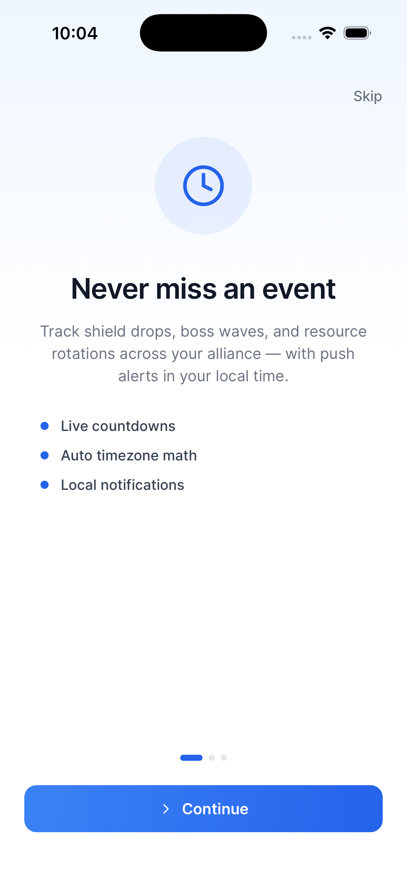
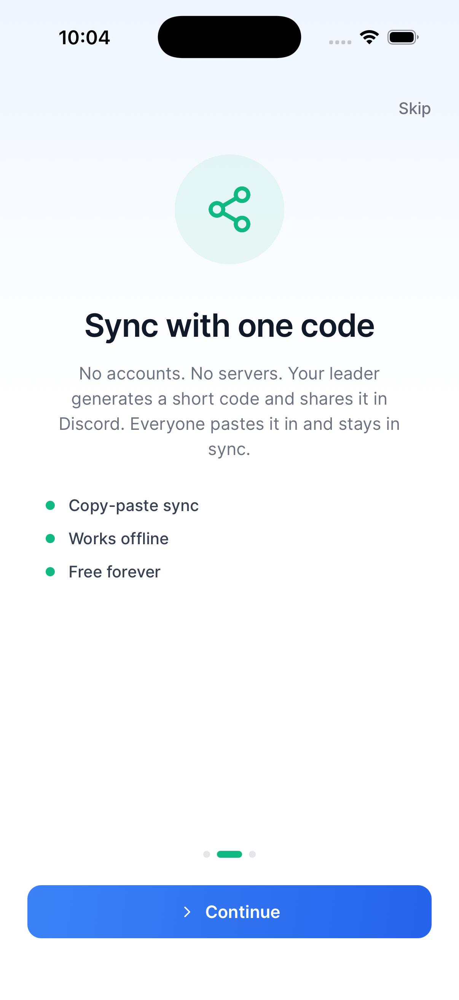
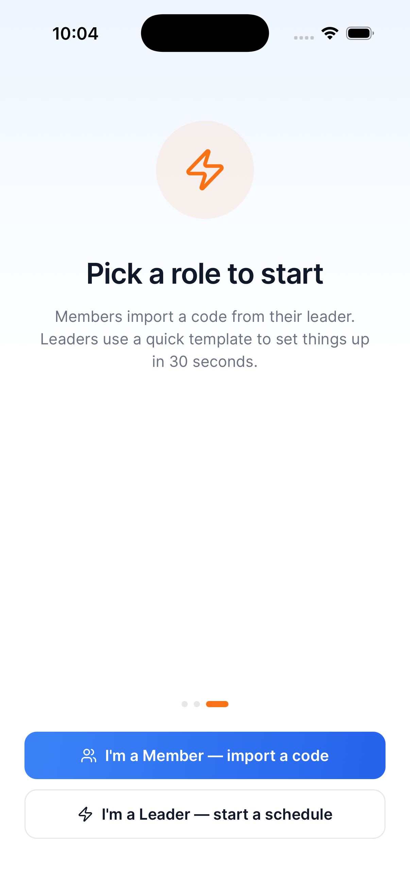

<](./LICENSE)
[](https://expo.dev)
[](https://expo.dev)
[](https://reactnative.dev)
[](https://www.typescriptlang.org)

**StratMate** is a cross-platform mobile + web app that helps gaming alliance leaders schedule events and members track them in real time — with zero accounts, zero servers, and zero complexity.

> Pick your game → build a schedule → share one code → everyone stays in sync. ⚔️

</div>

---

## 📱 Screenshots

<table>
  <tr>
    <td align="center"><b>Never Miss an Event</b></td>
    <td align="center"><b>Sync with One Code</b></td>
    <td align="center"><b>Pick Your Role</b></td>
  </tr>
  <tr>
    <td></td>
    <td></td>
    <td></td>
  </tr>
</table>

<table>
  <tr>
    <td align="center"><b>Home — Live Dashboard</b></td>
    <td align="center"><b>Events — Full Timeline</b></td>
  </tr>
  <tr>
    <td></td>
    <td></td>
  </tr>
</table>

<table>
  <tr>
    <td align="center"><b>Build — Schedule Maker</b></td>
    <td align="center"><b>Help — FAQ</b></td>
    <td align="center"><b>Settings</b></td>
  </tr>
  <tr>
    <td></td>
    <td></td>
    <td></td>
  </tr>
</table>

---

## ✨ Features

### 🏠 Home — Live Dashboard
The home screen shows your alliance name and a live countdown to the **next upcoming event**, along with quick stats:
- **Next Event card** — shows event name, exact fire time, category badge (Combat / Defense / Economy), and repeat interval
- **Timezone strip** — displays Server UTC offset vs. your Device offset so you always know the gap at a glance
- **In Sync indicator** — confirms your schedule is active and up to date
- **Event summary tiles** — quick counts for Total Events, Next 24h, Done, and Snoozed
- **Upcoming events list** — tap to snooze or mark done; long-press to fast-snooze

### 📅 Events — Full Timeline
A complete chronological list of every upcoming event fire, with powerful filters:
- **Category filter pills** — quickly view All, Defense, Combat, Economy, or Custom events
- **Search bar** — find any event by name instantly
- **Precise local times** — all times are shown in your device timezone, automatically
- **Repeat intervals** — see exactly how often each event recurs (e.g. every 240m, every 360m)
- Supports games with **multiple overlapping event types** (Shield Drop, Boss Wave, Resource Reset, etc.)

### 🔨 Build — Schedule Maker
For alliance **leaders** to create and share a schedule in under 30 seconds:
- **Game library** — browse 12+ pre-configured games (Rise of Kingdoms, Lords Mobile, War & Order, and more)
  - Each game comes with its standard event templates pre-loaded
- **Alliance name** — personalise the schedule for your group
- **Server UTC offset** — set the game server's timezone once; StratMate handles all the math
- **Add Event** — create custom events with name, category, first fire time, and repeat interval
- **Team Code generation** — one tap creates a compact `TEAM1-…` code you can paste into Discord
- **Member import** — paste a Team Code → tap Import → instantly synced, no account required

### ❓ Help — FAQ
Built-in FAQ covering everything your alliance members might ask:
- What's a Team Code?
- How do notifications work?
- What does the server offset mean?
- How does the QR code work?
- Why is my time off by a few minutes?
- Can I be in multiple alliances?
- My code does not work — what now?

All answers are available **fully offline**. No internet required.

### ⚙️ Settings
- **Push alerts** — toggle local notifications on/off for all upcoming events
- **Send test notification** — fires a test alert in 5 seconds so you can confirm your setup
- **Device timezone display** — shows your current offset at a glance
- **Alert sound** — choose between Sound On (uses device alert tone) or Silent (banner only)
- **Leave alliance** — clears the current schedule and cancels all alerts
- **Show intro again** — re-watch the onboarding guide at any time

---

## 🏗️ Architecture

```
stratmate/
├── apps/
│   ├── mobile/              # Expo (React Native) iOS & Android app
│   │   ├── src/
│   │   │   ├── app/         # expo-router file-based screens
│   │   │   ├── components/  # Shared UI components
│   │   │   └── utils/       # Auth, uploads, IAP, timezone helpers
│   │   ├── assets/images/   # App icons & splash screens
│   │   └── Screenshots/     # App preview screenshots
│   └── web/                 # React Router v7 companion web app
│       ├── src/app/         # File-based web routes
│       └── __create/        # Server entry (Hono + NeonDB)
└── shared/
    └── design-mode/         # Shared design tokens
```

---

## 🛠️ Tech Stack

| Layer | Technology |
|-------|-----------|
| Mobile Framework | [Expo](https://expo.dev) SDK 53 · React Native 0.79 |
| Language | TypeScript 5.x |
| Navigation | [expo-router](https://expo.github.io/router) (file-based) |
| Web Framework | [React Router v7](https://reactrouter.com) · Vite |
| Web Server | [Hono](https://hono.dev) on Node.js |
| Database | [Neon](https://neon.tech) (serverless Postgres) |
| Auth | [@auth/core](https://authjs.dev) + JWT via SecureStore |
| State Management | [Zustand](https://zustand-demo.pmnd.rs) |
| Async Data | [TanStack Query](https://tanstack.com/query) |
| Styling | Tailwind CSS (NativeWind) |
| File Uploads | [Uploadcare](https://uploadcare.com) |
| In-App Purchases | [RevenueCat](https://www.revenuecat.com) |
| Notifications | expo-notifications (local) |

---

## 🚀 Getting Started

### Prerequisites

| Tool | Version |
|------|---------|
| [Node.js](https://nodejs.org/) | ≥ 18 |
| [Expo CLI](https://docs.expo.dev/get-started/installation/) | Latest |
| [Xcode](https://developer.apple.com/xcode/) | For iOS simulator |
| [Android Studio](https://developer.android.com/studio) | For Android emulator |

### Mobile App

```bash
# 1. Navigate to the mobile app
cd apps/mobile

# 2. Install dependencies
npm install

# 3. Copy the environment template
cp .env.example .env
# Fill in your values in .env

# 4. Start the development server
npx expo start

# Run on iOS simulator
npx expo start --ios

# Run on Android emulator
npx expo start --android
```

### Web App

```bash
# 1. Navigate to the web app
cd apps/web

# 2. Install dependencies
npm install

# 3. Copy the environment template
cp .env.example .env
# Fill in DATABASE_URL and other values

# 4. Start the dev server
npm run dev
```

---

## 🔐 Environment Variables

### Mobile (`apps/mobile/.env`)

| Variable | Description |
|----------|-------------|
| `EXPO_PUBLIC_BASE_URL` | Your deployed web app URL |
| `EXPO_PUBLIC_HOST` | Your app host domain |
| `EXPO_PUBLIC_APP_ID` | Unique app identifier |
| `EXPO_PUBLIC_GOOGLE_MAPS_API_KEY` | Google Maps (if used) |
| `EXPO_PUBLIC_UPLOADCARE_PUBLIC_KEY` | File upload key |
| `EXPO_PUBLIC_REVENUE_CAT_APP_STORE_API_KEY` | RevenueCat iOS key |
| `EXPO_PUBLIC_REVENUE_CAT_PLAY_STORE_API_KEY` | RevenueCat Android key |
| `EXPO_PUBLIC_LOGS_ENDPOINT` | Remote error logging endpoint |
| `EXPO_PUBLIC_LOGS_API_KEY` | Remote error logging key |

See [`apps/mobile/.env.example`](apps/mobile/.env.example) for the full template.

### Web (`apps/web/.env`)

| Variable | Description |
|----------|-------------|
| `DATABASE_URL` | Neon PostgreSQL connection string |
| `AUTH_SECRET` | NextAuth secret (32+ chars) |

See [`apps/web/.env.example`](apps/web/.env.example) for the full template.

> ⚠️ **Never commit `.env` files.** They are listed in `.gitignore`.

---

## 📤 How to Push to GitHub

Follow these steps to publish StratMate to your own GitHub repository:

### Step 1 — Create a GitHub Repository

1. Go to [github.com/new](https://github.com/new)
2. Repository name: `stratmate`
3. Set it to **Public** or **Private** — your choice
4. **Do NOT** initialise with a README, .gitignore, or license (we already have them)
5. Click **Create repository**
6. Copy the remote URL shown (e.g. `https://github.com/YOUR_USERNAME/stratmate.git`)

### Step 2 — Connect & Push from Terminal

Open your terminal in the project root (`/Users/aashish/Downloads/anything`) and run:

```bash
# Add your GitHub repo as the remote origin
git remote add origin https://github.com/YOUR_USERNAME/stratmate.git

# Stage everything
git add .

# Create your first commit
git commit -m "🚀 Initial release — StratMate v1.0.0"

# Push to GitHub
git push -u origin main
```

> If your default branch is `master` instead of `main`, use `git push -u origin master`.

### Step 3 — Verify on GitHub

Visit `https://github.com/YOUR_USERNAME/stratmate` — you should see:
- ✅ All source files
- ✅ `README.md` rendered with screenshots
- ✅ `LICENSE` file displayed
- ✅ No `.env` files or `node_modules`

### Tips for a Professional GitHub Profile

- **Add a description** on your repo page: *"Easy strategy calculator for mobile gaming alliances — iOS, Android & Web"*
- **Add topics/tags**: `react-native`, `expo`, `gaming`, `strategy`, `mobile`, `typescript`
- **Pin the repo** on your GitHub profile so it appears at the top
- **Add a star** to encourage others ⭐

---

## 🤝 Contributing

Contributions, issues and feature requests are welcome!

1. Fork the repository
2. Create your feature branch: `git checkout -b feature/amazing-feature`
3. Commit your changes: `git commit -m 'feat: add amazing feature'`
4. Push to the branch: `git push origin feature/amazing-feature`
5. Open a Pull Request

---

## 📄 License

```
MIT License

Copyright (c) 2025 Aashish

Permission is hereby granted, free of charge, to any person obtaining a copy
of this software and associated documentation files (the "Software"), to deal
in the Software without restriction, including without limitation the rights
to use, copy, modify, merge, publish, distribute, sublicense, and/or sell
copies of the Software, and to permit persons to whom the Software is
furnished to do so, subject to the following conditions:

The above copyright notice and this permission notice shall be included in all
copies or substantial portions of the Software.

THE SOFTWARE IS PROVIDED "AS IS", WITHOUT WARRANTY OF ANY KIND, EXPRESS OR
IMPLIED, INCLUDING BUT NOT LIMITED TO THE WARRANTIES OF MERCHANTABILITY,
FITNESS FOR A PARTICULAR PURPOSE AND NONINFRINGEMENT. IN NO EVENT SHALL THE
AUTHORS OR COPYRIGHT HOLDERS BE LIABLE FOR ANY CLAIM, DAMAGES OR OTHER
LIABILITY, WHETHER IN AN ACTION OF CONTRACT, TORT OR OTHERWISE, ARISING FROM,
OUT OF OR IN CONNECTION WITH THE SOFTWARE OR THE USE OR OTHER DEALINGS IN THE
SOFTWARE.
```

See the [LICENSE](./LICENSE) file for full details.

---

<div align="center">

Made with ❤️ by **Aashish**

⭐ If you find this useful, please star the repo!

</div>
]]>
