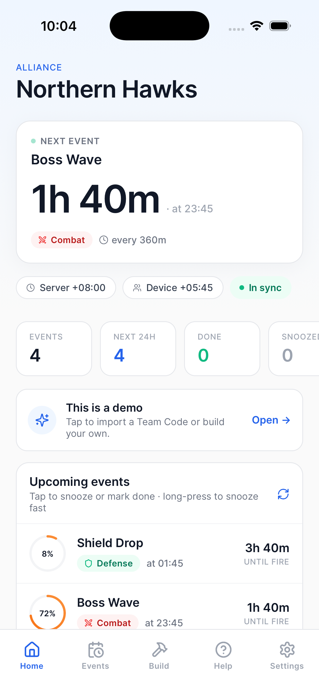
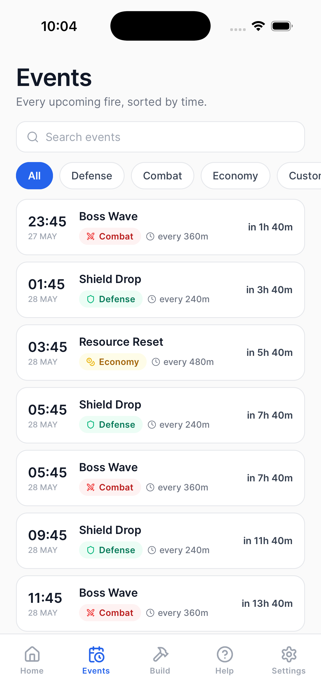
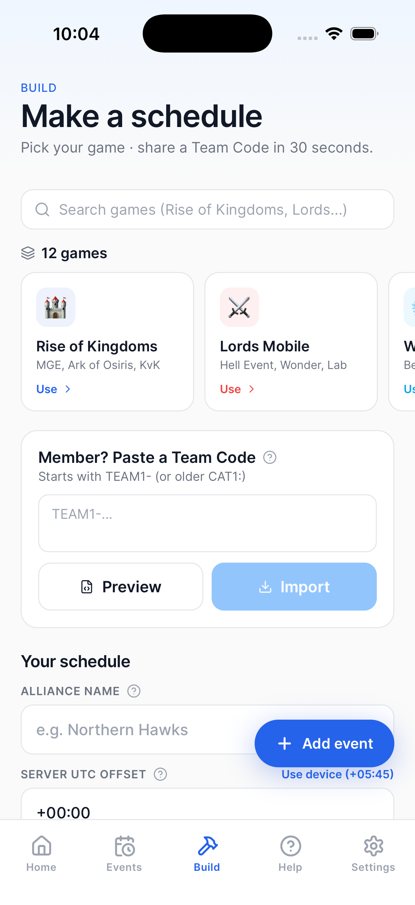
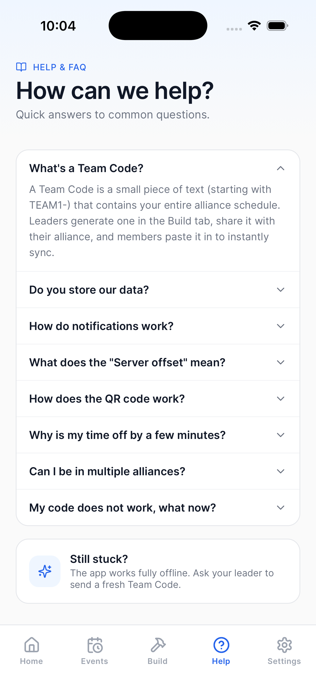
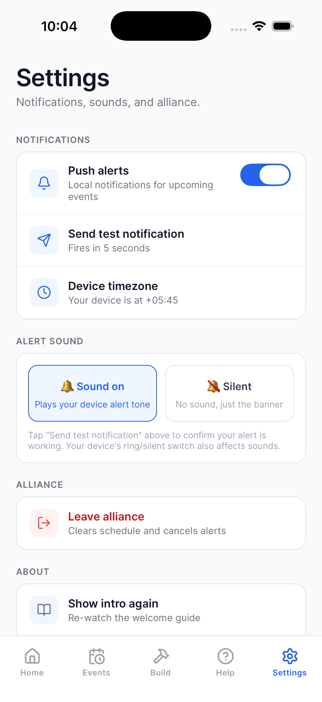

<div align="center">


# StratMate

### Easy Strategy Calculator for Mobile Gaming Alliances

[](./LICENSE)
[](https://expo.dev)
[](https://expo.dev)
[](https://reactnative.dev)
[](https://www.typescriptlang.org)

**StratMate** helps gaming alliance leaders schedule events and keep every member in sync — with zero accounts, zero servers, and zero complexity.

> Pick your game → build a schedule → share one code → everyone stays in sync ⚔️

</div>

---

## 📱 Screenshots

<div align="center">

### Onboarding

| Never Miss an Event | Sync with One Code | Pick Your Role |
|:---:|:---:|:---:|
|  |  |  |

### App Screens

| Home — Live Dashboard | Events — Full Timeline |
|:---:|:---:|
|  |  |

| Build — Schedule Maker | Help & FAQ | Settings |
|:---:|:---:|:---:|
|  |  |  |

</div>

---

## ✨ Features

### 🏠 Home — Live Dashboard
- **Next Event card** — live countdown with event name, fire time, category badge (Combat / Defense / Economy) and repeat interval
- **Timezone strip** — shows Server UTC offset vs your Device offset side-by-side
- **In Sync indicator** — confirms your schedule is live
- **Event summary tiles** — quick counts for Total, Next 24h, Done, Snoozed
- **Upcoming events list** — tap to snooze or mark done; long-press to fast-snooze

### 📅 Events — Full Timeline
- Chronological list of every upcoming event fire
- **Category filter pills** — All, Defense, Combat, Economy, Custom
- **Search bar** — find any event instantly
- All times shown in **your device timezone** automatically
- Shows repeat intervals (e.g. every 240m, every 360m)

### 🔨 Build — Schedule Maker
- **12+ pre-configured games** — Rise of Kingdoms, Lords Mobile, War & Order, and more
- Set your **Alliance name** and **Server UTC offset** once
- **Add custom events** — name, category, first fire time, repeat interval
- **Team Code generator** — creates a compact `TEAM1-…` code to share in Discord
- **Member import** — paste a Team Code → tap Import → instantly synced, no account needed

### ❓ Help — Built-in FAQ
- What's a Team Code?
- How do notifications work?
- What does the Server offset mean?
- How does the QR code work?
- All answers available **fully offline**

### ⚙️ Settings
- Toggle **push alerts** on/off for all events
- **Send test notification** — fires in 5 seconds
- Choose **Sound On** or **Silent** alert mode
- **Leave alliance** — clears schedule and cancels all alerts

---

## 🏗️ Project Structure

```
stratmate/
├── apps/
│   ├── mobile/              # Expo (React Native) iOS & Android app
│   │   ├── src/
│   │   │   ├── app/         # expo-router file-based screens
│   │   │   ├── components/  # Shared UI components
│   │   │   └── utils/       # Auth, uploads, IAP, timezone helpers
│   │   ├── assets/images/   # App icons & splash screens
│   │   └── Screenshots/     # App preview screenshots
│   └── web/                 # React Router v7 companion web app
└── shared/
    └── design-mode/         # Shared design tokens
```

---

## 🛠️ Tech Stack

| Layer | Technology |
|-------|-----------|
| Mobile Framework | Expo SDK 53 · React Native 0.79 |
| Language | TypeScript 5.x |
| Navigation | expo-router (file-based) |
| Web Framework | React Router v7 · Vite |
| Web Server | Hono on Node.js |
| Database | Neon (serverless Postgres) |
| State | Zustand |
| Async Data | TanStack Query |
| Styling | Tailwind CSS (NativeWind) |
| Notifications | expo-notifications (local) |
| In-App Purchases | RevenueCat |

---

## 🚀 Getting Started

### Prerequisites
- Node.js ≥ 18
- Expo CLI (`npm install -g expo-cli`)
- Xcode (iOS) or Android Studio (Android)

### Mobile

```bash
cd apps/mobile
npm install
cp .env.example .env   # fill in your values
npx expo start --ios
```

### Web

```bash
cd apps/web
npm install
cp .env.example .env   # fill in DATABASE_URL etc.
npm run dev
```

---

## 🔐 Environment Variables

### Mobile (`apps/mobile/.env`)

| Variable | Description |
|----------|-------------|
| `EXPO_PUBLIC_BASE_URL` | Your deployed web app URL |
| `EXPO_PUBLIC_HOST` | Your app host domain |
| `EXPO_PUBLIC_UPLOADCARE_PUBLIC_KEY` | File upload key |
| `EXPO_PUBLIC_REVENUE_CAT_APP_STORE_API_KEY` | RevenueCat iOS key |
| `EXPO_PUBLIC_LOGS_ENDPOINT` | Remote error logging endpoint |

> ⚠️ Never commit `.env` files — they are in `.gitignore`

---

## 📄 License

```
MIT License — Copyright (c) 2026 Aashish
```

This project is licensed under the MIT License — see the [LICENSE](./LICENSE) file for details.

---

<div align="center">

Made with ❤️ by **Aashish**

⭐ Star this repo if you find it useful!

</div>
